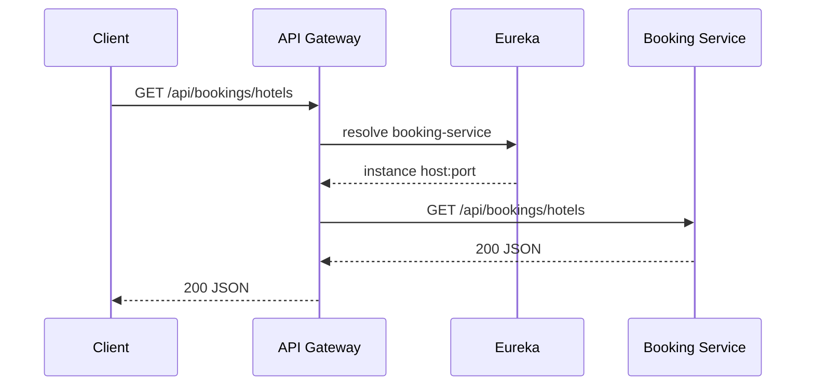
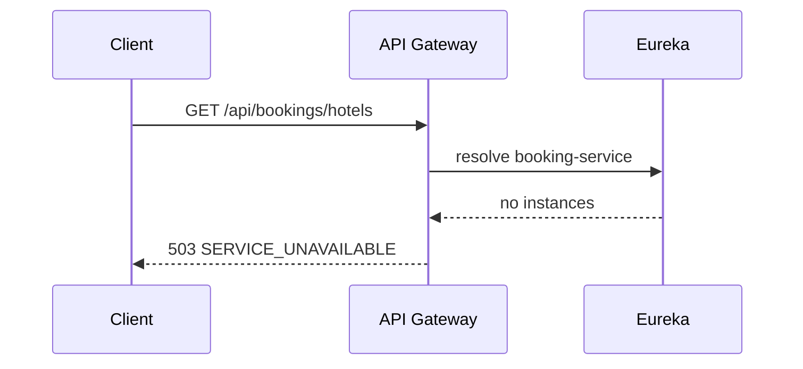
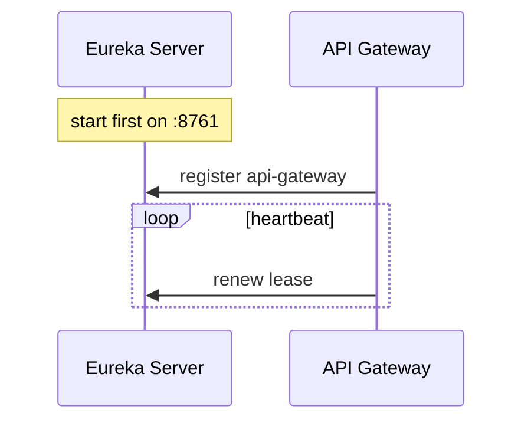

# Phase 1 Sequence — Client to Gateway to Eureka

## Happy path after later services exist

## Phase 1 actual path (no booking service yet)

## Startup order

If Gateway starts before Eureka, it retries registration. That usually recovers, but the reliable demo order is **Eureka first, then Gateway**.
