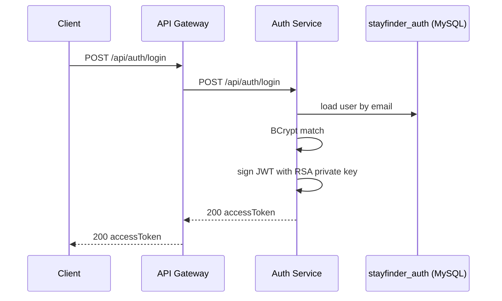
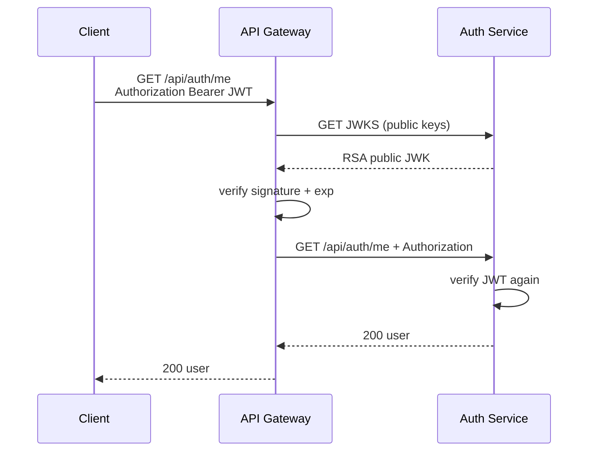
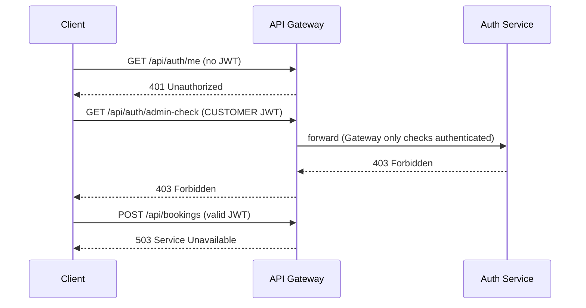

# Phase 2 Sequence — JWT issue and validation

## Login

```mermaid
sequenceDiagram
    participant C as Client
    participant G as API Gateway
    participant A as Auth Service
    participant DB as stayfinder_auth (MySQL)

    C->>G: POST /api/auth/login
    G->>A: POST /api/auth/login
    A->>DB: load user by email
    A->>A: BCrypt match
    A->>A: sign JWT with RSA private key
    A-->>G: 200 accessToken
    G-->>C: 200 accessToken
```

## Protected request

```mermaid
sequenceDiagram
    participant C as Client
    participant G as API Gateway
    participant A as Auth Service

    C->>G: GET /api/auth/me<br/>Authorization Bearer JWT
    G->>A: GET JWKS (public keys)
    A-->>G: RSA public JWK
    G->>G: verify signature + exp
    G->>A: GET /api/auth/me + Authorization
    A->>A: verify JWT again
    A-->>G: 200 user
    G-->>C: 200 user
```

## 401 vs 403 vs 503

```mermaid
sequenceDiagram
    participant C as Client
    participant G as API Gateway
    participant A as Auth Service

    C->>G: GET /api/auth/me (no JWT)
    G-->>C: 401 Unauthorized

    C->>G: GET /api/auth/admin-check (CUSTOMER JWT)
    G->>A: forward (Gateway only checks authenticated)
    A-->>G: 403 Forbidden
    G-->>C: 403 Forbidden

    C->>G: POST /api/bookings (valid JWT)
    G-->>C: 503 Service Unavailable
```
