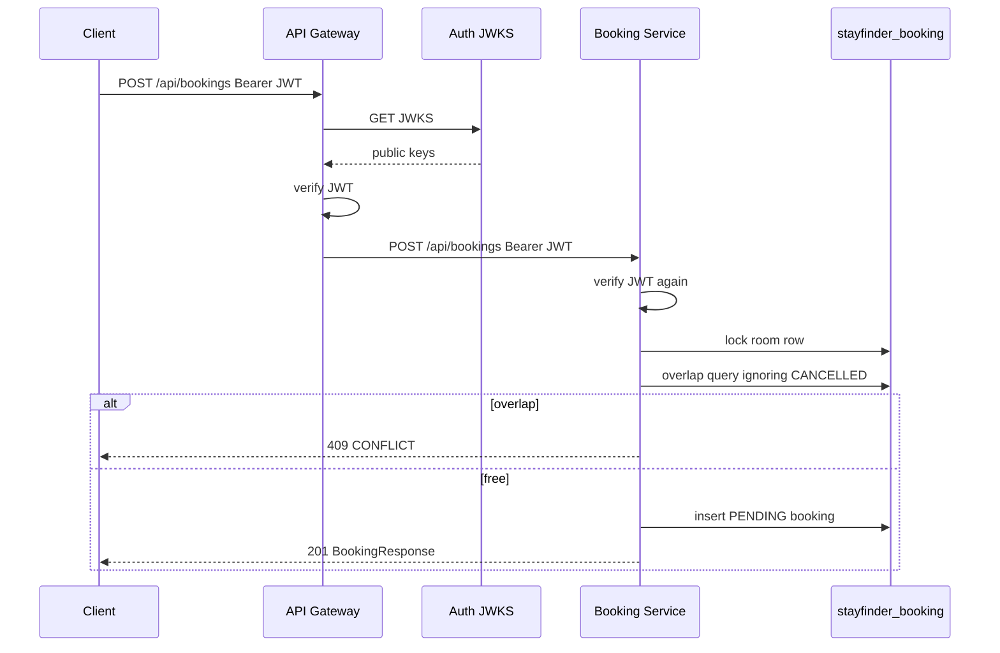
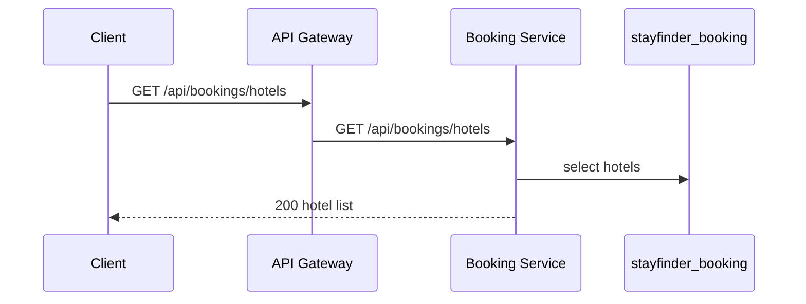

# Phase 3 Sequence — Create booking

```mermaid
sequenceDiagram
    participant C as Client
    participant G as API Gateway
    participant A as Auth JWKS
    participant B as Booking Service
    participant DB as stayfinder_booking

    C->>G: POST /api/bookings Bearer JWT
    G->>A: GET JWKS
    A-->>G: public keys
    G->>G: verify JWT
    G->>B: POST /api/bookings Bearer JWT
    B->>B: verify JWT again
    B->>DB: lock room row
    B->>DB: overlap query ignoring CANCELLED
    alt overlap
        B-->>C: 409 CONFLICT
    else free
        B->>DB: insert PENDING booking
        B-->>C: 201 BookingResponse
    end
```

Public catalog (no JWT):

```mermaid
sequenceDiagram
    participant C as Client
    participant G as API Gateway
    participant B as Booking Service
    participant DB as stayfinder_booking

    C->>G: GET /api/bookings/hotels
    G->>B: GET /api/bookings/hotels
    B->>DB: select hotels
    B-->>C: 200 hotel list
```
