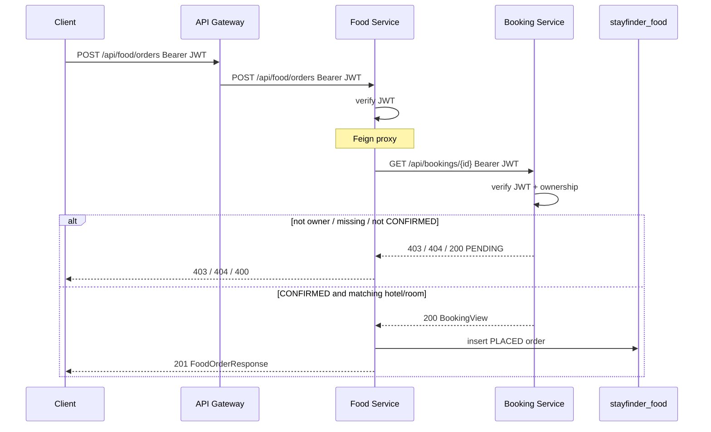
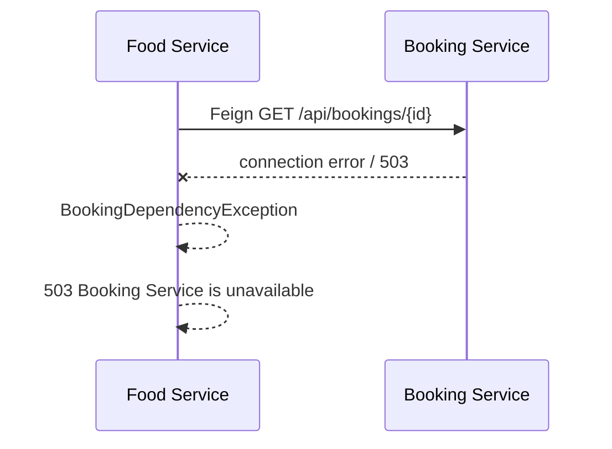

# Phase 4 Sequence — Food order with Feign

```mermaid
sequenceDiagram
    participant C as Client
    participant G as API Gateway
    participant F as Food Service
    participant B as Booking Service
    participant FDB as stayfinder_food

    C->>G: POST /api/food/orders Bearer JWT
    G->>F: POST /api/food/orders Bearer JWT
    F->>F: verify JWT
    Note over F: Feign proxy
    F->>B: GET /api/bookings/{id} Bearer JWT
    B->>B: verify JWT + ownership
    alt not owner / missing / not CONFIRMED
        B-->>F: 403 / 404 / 200 PENDING
        F-->>C: 403 / 404 / 400
    else CONFIRMED and matching hotel/room
        B-->>F: 200 BookingView
        F->>FDB: insert PLACED order
        F-->>C: 201 FoodOrderResponse
    end
```

If Booking is down (Phase 4, no circuit breaker yet):

```mermaid
sequenceDiagram
    participant F as Food Service
    participant B as Booking Service

    F->>B: Feign GET /api/bookings/{id}
    B--xF: connection error / 503
    F-->>F: BookingDependencyException
    F-->>F: 503 Booking Service is unavailable
```
