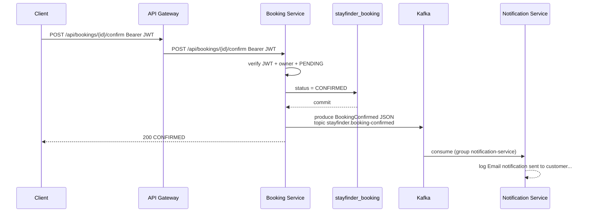
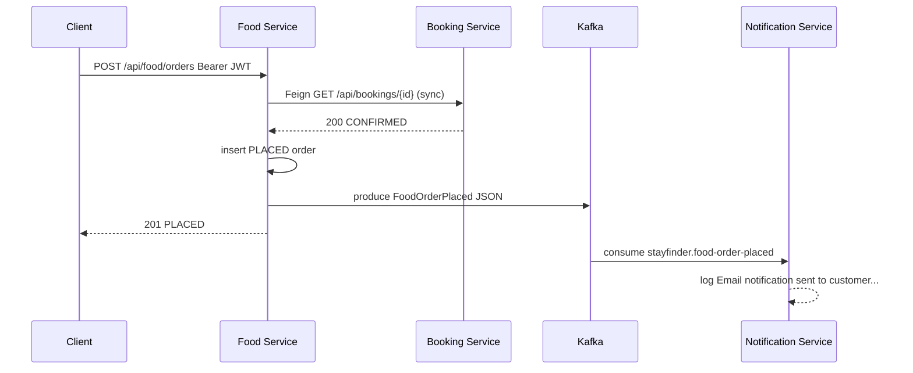
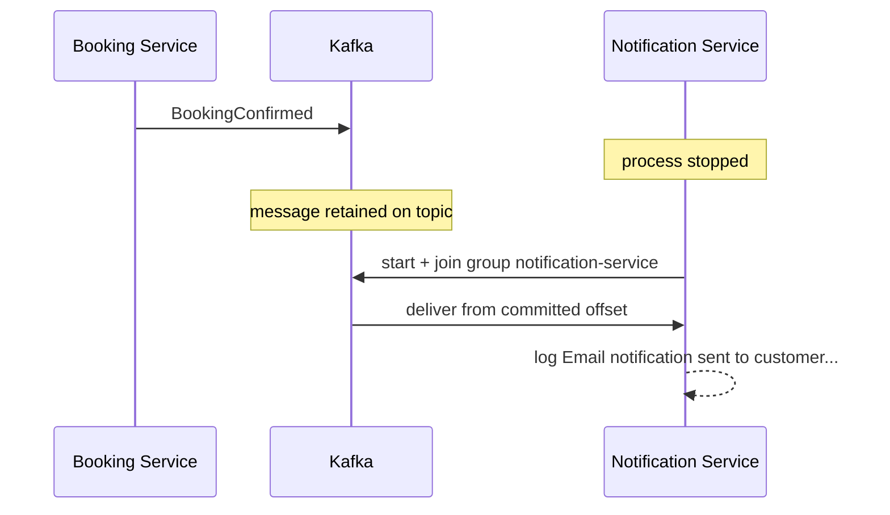
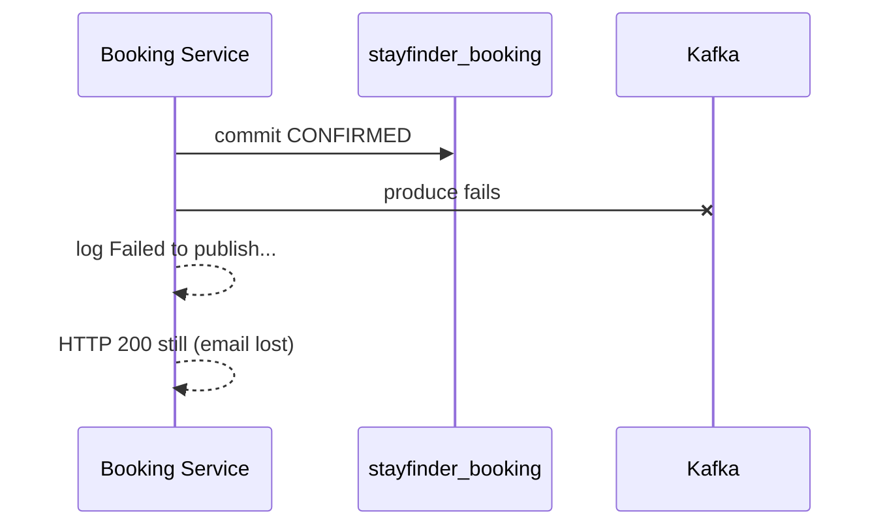

# Phase 5 Sequence — Kafka notifications

Confirm booking (happy path):

Place food order (event after Feign validation):

Notification down (messages wait):

Kafka down after DB commit (dual-write gap):

