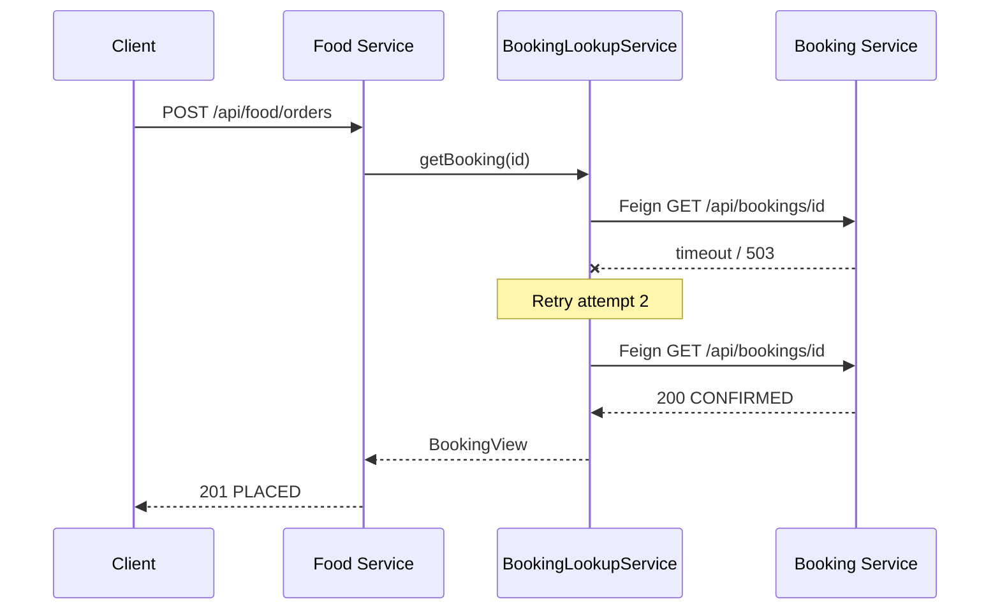
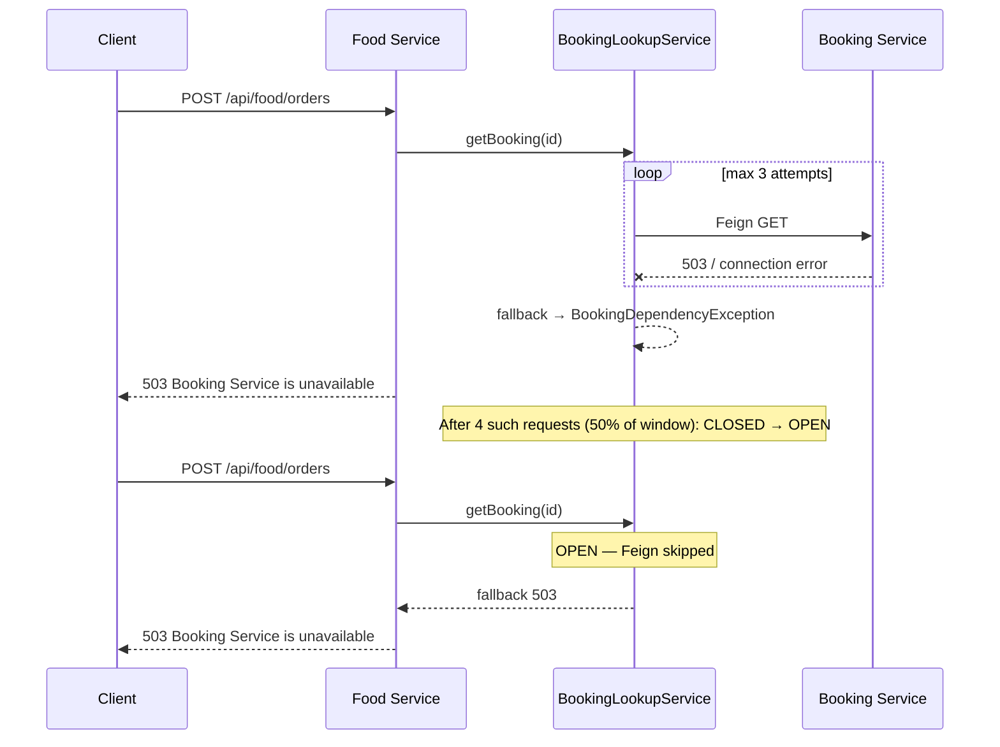

# Phase 6 Sequence — Retry, circuit breaker, fallback

Transient Booking failure (retry succeeds):



Booking down (retries exhausted, then circuit opens):



Wrong fallback (what we did **not** do):

```text
fallback returns fake CONFIRMED BookingView
        → Food inserts PLACED order
        → guest may not have a room
```

StayFinder fails closed instead.
