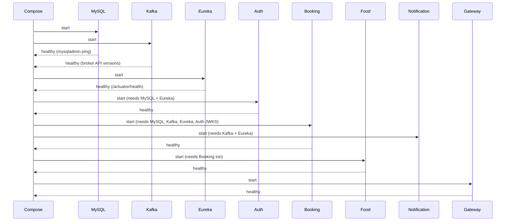
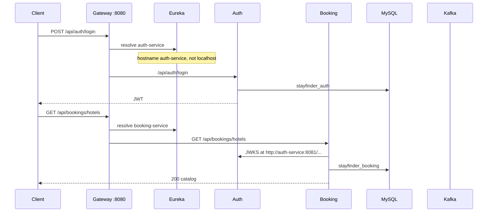

# Phase 7 Sequence — Compose startup and a request through Gateway

Startup order (healthchecks, not just process start):

```mermaid
sequenceDiagram
    participant C as Compose
    participant M as MySQL
    participant K as Kafka
    participant E as Eureka
    participant A as Auth
    participant B as Booking
    participant F as Food
    participant N as Notification
    participant G as Gateway

    C->>M: start
    C->>K: start
    M-->>C: healthy (mysqladmin ping)
    K-->>C: healthy (broker API versions)
    C->>E: start
    E-->>C: healthy (/actuator/health)
    C->>A: start (needs MySQL + Eureka)
    A-->>C: healthy
    C->>B: start (needs MySQL, Kafka, Eureka, Auth JWKS)
    C->>N: start (needs Kafka + Eureka)
    B-->>C: healthy
    C->>F: start (needs Booking too)
    F-->>C: healthy
    C->>G: start
    G-->>C: healthy
```

A booking request after the stack is up:

```mermaid
sequenceDiagram
    participant Client
    participant G as Gateway :8080
    participant E as Eureka
    participant A as Auth
    participant B as Booking
    participant MySQL
    participant Kafka

    Client->>G: POST /api/auth/login
    G->>E: resolve auth-service
    Note over E: hostname auth-service, not localhost
    G->>A: /api/auth/login
    A->>MySQL: stayfinder_auth
    A-->>Client: JWT

    Client->>G: GET /api/bookings/hotels
    G->>E: resolve booking-service
    G->>B: GET /api/bookings/hotels
    B->>A: JWKS at http://auth-service:8081/...
    B->>MySQL: stayfinder_booking
    B-->>Client: 200 catalog
```
