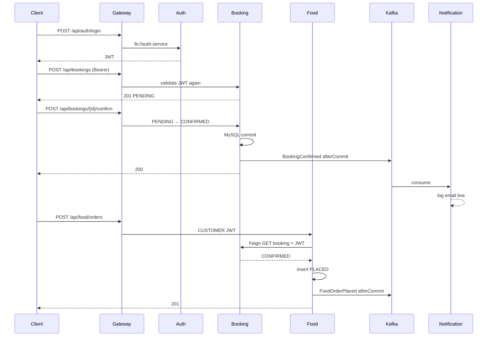
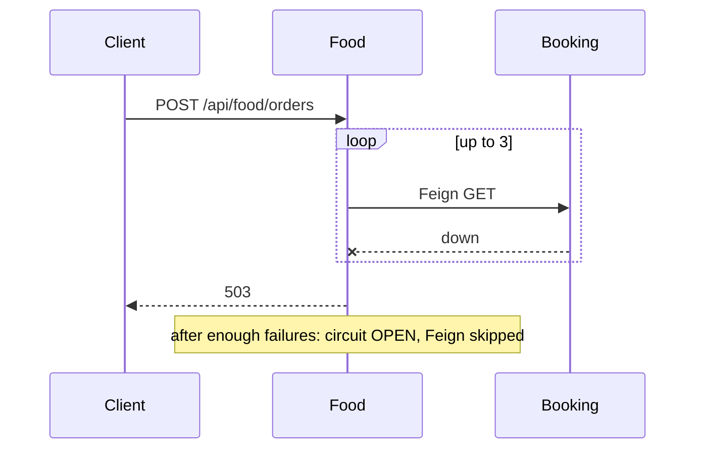

# Phase 8 Sequence — Happy path (interview demo)

```mermaid
sequenceDiagram
    participant C as Client
    participant G as Gateway
    participant A as Auth
    participant B as Booking
    participant F as Food
    participant K as Kafka
    participant N as Notification

    C->>G: POST /api/auth/login
    G->>A: lb://auth-service
    A-->>C: JWT

    C->>G: POST /api/bookings (Bearer)
    G->>B: validate JWT again
    B-->>C: 201 PENDING

    C->>G: POST /api/bookings/{id}/confirm
    G->>B: PENDING → CONFIRMED
    B->>B: MySQL commit
    B->>K: BookingConfirmed afterCommit
    B-->>C: 200
    K->>N: consume
    N-->>N: log email line

    C->>G: POST /api/food/orders
    G->>F: CUSTOMER JWT
    F->>B: Feign GET booking + JWT
    B-->>F: CONFIRMED
    F->>F: insert PLACED
    F->>K: FoodOrderPlaced afterCommit
    F-->>C: 201
```

Booking down (fail closed):

```mermaid
sequenceDiagram
    participant C as Client
    participant F as Food
    participant B as Booking

    C->>F: POST /api/food/orders
    loop up to 3
        F->>B: Feign GET
        B--xF: down
    end
    F-->>C: 503
    Note over F: after enough failures: circuit OPEN, Feign skipped
```
