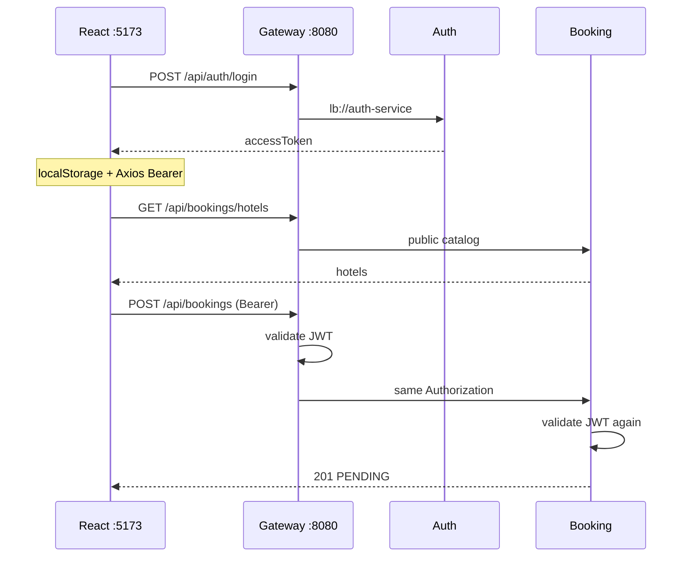
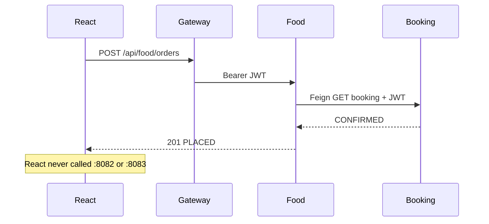

# Phase 9 Sequence — React through the Gateway

Login and a booking:

```mermaid
sequenceDiagram
    participant R as React :5173
    participant G as Gateway :8080
    participant A as Auth
    participant B as Booking

    R->>G: POST /api/auth/login
    G->>A: lb://auth-service
    A-->>R: accessToken
    Note over R: localStorage + Axios Bearer
    R->>G: GET /api/bookings/hotels
    G->>B: public catalog
    B-->>R: hotels
    R->>G: POST /api/bookings (Bearer)
    G->>G: validate JWT
    G->>B: same Authorization
    B->>B: validate JWT again
    B-->>R: 201 PENDING
```

Food order (browser still only sees Gateway):

```mermaid
sequenceDiagram
    participant R as React
    participant G as Gateway
    participant F as Food
    participant B as Booking

    R->>G: POST /api/food/orders
    G->>F: Bearer JWT
    F->>B: Feign GET booking + JWT
    B-->>F: CONFIRMED
    F-->>R: 201 PLACED
    Note over R: React never called :8082 or :8083
```
